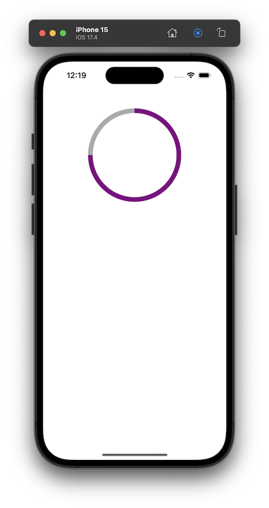

# PDPiewView



## How to use

```Swift
let pieView = PDPieView(x: (vw - 200) / 2, y: 100, width: 200);
view.addSubview(pieView);

pieView
	.border(color: .purple)
	.border(W: 10)
	.show(75);
```

***

Copyright (c) 2024 [邱敬幃 Pardn Ltd](https://linkedin.com/in/pardnchiu)

